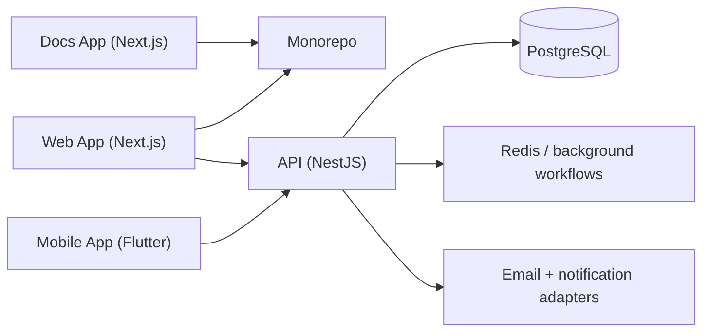

## High-level architecture

## Current monorepo shape

| Area | Technology | Purpose |
| --- | --- | --- |
| `apps/api` | NestJS | Auth, shops, orders, billing, notifications, exports, and platform APIs |
| `apps/web` | Next.js | Marketing, platform-owner workspace, shop-owner workspace |
| `apps/mobile` | Flutter | Mobile operational workflow for active shops |
| `apps/docs` | Next.js | Product, operator, and API documentation |
| `packages/*` | Shared configs and UI | Reusable TypeScript, ESLint, and UI utilities |

## Design choices

- The workspace is organized as a Turborepo so builds, linting, and type checks stay package-based.
- The docs app is now a standalone Next.js site that uses MDX content and static search data.
- The API is the enforcement layer for permissions and plan-gated features.
- Web and mobile clients consume the same core backend surface while presenting different
  operational experiences.

## Why this matters

The documentation site is no longer a single hardcoded page. It now mirrors the platform structure
closely enough to explain:

- how operator workflows map to backend capabilities
- where future third-party integration work fits
- how the different applications in the monorepo relate to one another
