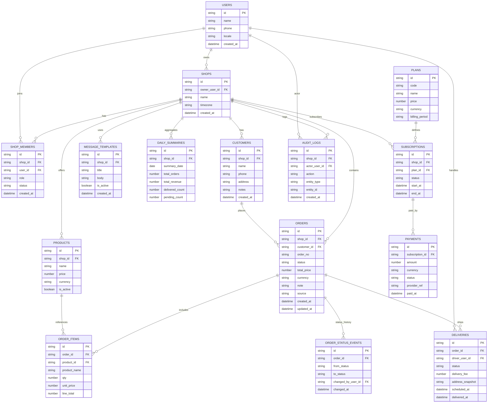

# Backend ERD

## Entity Relationship Diagram

```mermaid
erDiagram
  USERS ||--o{ SHOPS : owns
  SHOPS ||--o{ SHOP_MEMBERS : has
  USERS ||--o{ SHOP_MEMBERS : joins
  SHOPS ||--o{ CUSTOMERS : has
  SHOPS ||--o{ PRODUCTS : offers
  SHOPS ||--o{ ORDERS : contains
  CUSTOMERS ||--o{ ORDERS : places
  ORDERS ||--o{ ORDER_ITEMS : includes
  PRODUCTS ||--o{ ORDER_ITEMS : references
  ORDERS ||--o{ ORDER_STATUS_EVENTS : status_history
  ORDERS ||--o{ DELIVERIES : ships
  USERS ||--o{ DELIVERIES : handles
  SHOPS ||--o{ MESSAGE_TEMPLATES : uses
  SHOPS ||--o{ DAILY_SUMMARIES : aggregates
  PLANS ||--o{ SUBSCRIPTIONS : defines
  SHOPS ||--o{ SUBSCRIPTIONS : subscribes
  SUBSCRIPTIONS ||--o{ PAYMENTS : paid_by
  SHOPS ||--o{ AUDIT_LOGS : logs
  USERS ||--o{ AUDIT_LOGS : actor

  USERS {
    string id PK
    string name
    string phone
    string locale
    datetime created_at
  }

  SHOPS {
    string id PK
    string owner_user_id FK
    string name
    string timezone
    datetime created_at
  }

  SHOP_MEMBERS {
    string id PK
    string shop_id FK
    string user_id FK
    string role
    string status
    datetime created_at
  }

  CUSTOMERS {
    string id PK
    string shop_id FK
    string name
    string phone
    string address
    string notes
    datetime created_at
  }

  PRODUCTS {
    string id PK
    string shop_id FK
    string name
    number price
    string currency
    boolean is_active
  }

  ORDERS {
    string id PK
    string shop_id FK
    string customer_id FK
    string order_no
    string status
    number total_price
    string currency
    string note
    string source
    datetime created_at
    datetime updated_at
  }

  ORDER_ITEMS {
    string id PK
    string order_id FK
    string product_id FK
    string product_name
    number qty
    number unit_price
    number line_total
  }

  ORDER_STATUS_EVENTS {
    string id PK
    string order_id FK
    string from_status
    string to_status
    string changed_by_user_id FK
    datetime changed_at
  }

  DELIVERIES {
    string id PK
    string order_id FK
    string driver_user_id FK
    string status
    number delivery_fee
    string address_snapshot
    datetime scheduled_at
    datetime delivered_at
  }

  MESSAGE_TEMPLATES {
    string id PK
    string shop_id FK
    string title
    string body
    boolean is_active
    datetime created_at
  }

  DAILY_SUMMARIES {
    string id PK
    string shop_id FK
    date summary_date
    number total_orders
    number total_revenue
    number delivered_count
    number pending_count
  }

  PLANS {
    string id PK
    string code
    string name
    number price
    string currency
    string billing_period
  }

  SUBSCRIPTIONS {
    string id PK
    string shop_id FK
    string plan_id FK
    string status
    datetime start_at
    datetime end_at
  }

  PAYMENTS {
    string id PK
    string subscription_id FK
    number amount
    string currency
    string status
    string provider_ref
    datetime paid_at
  }

  AUDIT_LOGS {
    string id PK
    string shop_id FK
    string actor_user_id FK
    string action
    string entity_type
    string entity_id
    datetime created_at
  }
```

## MVP Subset
MVP can be implemented with a subset of entities:
- USERS
- SHOPS
- SHOP_MEMBERS
- CUSTOMERS
- ORDERS
- ORDER_STATUS_EVENTS
