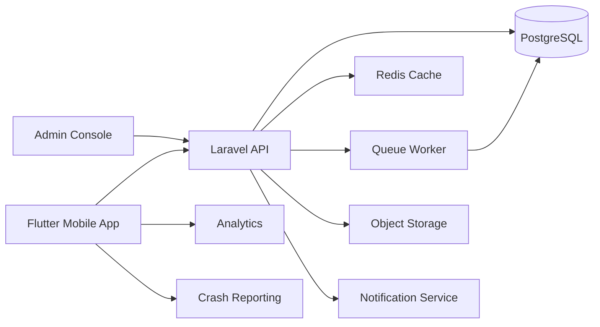

# Architecture and Infrastructure

## High-Level Architecture

## Core Components
- Flutter mobile app for sellers
- Laravel API for business logic and authentication
- PostgreSQL database for orders and customers
- Redis for cache and queues
- Queue workers for background jobs
- Object storage for optional assets
- Analytics and crash reporting for product health

## Data Storage Strategy
- Use PostgreSQL with UUID primary keys for main entities
- Normalize core entities with indexed foreign keys
- Add composite indexes for common filters like shop_id, status, created_at
- Use database views or materialized summaries for reporting
- Precompute daily summaries via scheduled jobs

## Environments
- Development for local testing
- Staging for internal QA
- Production for live users

## Availability and Performance
- Use a nearby APAC region to reduce latency
- Cache common lists and summaries
- Support offline mode with local device cache and sync

## Cost Control
- Limit heavy report queries
- Use read replicas only if needed
- Archive completed orders after 90 days

## Security
- Token authentication with Laravel Sanctum or Passport
- Role-based access for owners and staff
- Audit log for status changes
