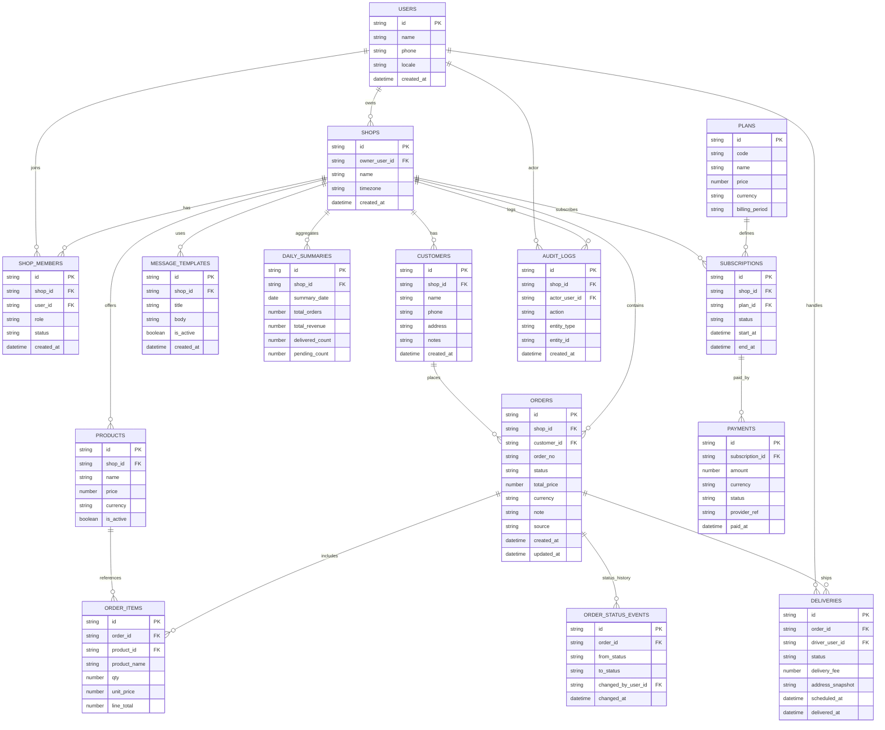
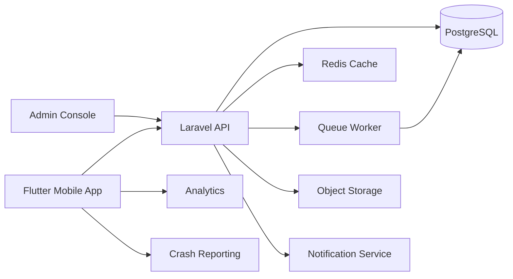

# Facebook Order Manager – Full Documentation

## Contents

- [Facebook Order Manager – Project Overview](#doc-00-overview)
- [Requirements](#doc-01-requirements)
- [User Stories](#doc-02-user-stories)
- [Features List](#doc-03-features)
- [Backend ERD](#doc-04-erd)
- [Architecture and Infrastructure](#doc-05-architecture-infra)
- [Suggested Backend API Endpoints](#doc-06-api-endpoints)
- [Project Plan](#doc-07-project-plan)
- [Roadmap](#doc-08-roadmap)
- [Non-Functional Requirements](#doc-09-non-functional-requirements)
- [Data Dictionary](#doc-10-data-dictionary)
- [Security and Privacy](#doc-11-security-privacy)
- [Testing Strategy](#doc-12-testing-strategy)
- [Analytics and Metrics](#doc-13-analytics-metrics)
- [Localization Plan](#doc-14-localization)
- [Risks and Assumptions](#doc-15-risks-assumptions)
- [New Project Setup](#doc-16-new-project-setup)
- [Standard REST API Response Structure](#doc-17-api-response-structure)

---

<a id="doc-00-overview"></a>

# Facebook Order Manager – Project Overview

## Summary
A lightweight mobile app that helps Facebook sellers track orders, manage customers, and organize deliveries. The product replaces messy notes or spreadsheets with a fast, Burmese-friendly workflow built around manual copy-paste from Messenger.

## Product Vision
Give small sellers a simple, local, reliable way to manage orders without complex integrations.

## Target Users
| Persona | Description | Primary Need |
| --- | --- | --- |
| Solo seller | Runs a small shop on Facebook and handles all orders alone. | Fast, simple order entry and status tracking. |
| Small team | 2 to 5 staff members handling orders and deliveries. | Shared access, clear status updates, accountability. |
| Delivery helper | Picks up tasks assigned by the seller. | Clear delivery list and status updates. |

## Success Metrics
| Metric | Target (MVP) |
| --- | --- |
| Weekly active sellers | 10+ |
| Orders logged per seller per week | 30+ |
| Seller retention (4 weeks) | 40%+ |
| Median order entry time | Under 30 seconds |

## Scope Boundaries
In scope for MVP:
- Manual order entry from chat
- Simple list and filters
- Status updates
- Daily summary
- Burmese UI

Out of scope for MVP:
- Facebook API integration
- Automatic message parsing
- Complex inventory and accounting

## Key Constraints
- Must work well on low-end Android devices
- Must support Burmese language UI and fonts
- Must remain simple enough to learn in 5 minutes

---

<a id="doc-01-requirements"></a>

# Requirements

## Functional Requirements
- Create orders manually with customer name, phone, address, product, price, and status
- View orders in a simple list
- Filter orders by Today, Pending, Delivered
- Update order status in one tap
- View daily summary with total orders, revenue, delivered vs pending
- Support Burmese language UI
- Basic authentication for sellers
- Data isolation per seller or shop

## Non-Functional Requirements
- App launch time under 3 seconds on low-end Android devices
- Order list loads in under 2 seconds for 500 orders
- Offline-first data entry with sync on reconnect
- Secure storage of customer phone numbers
- Data backups and recovery plan
- 99.5% monthly uptime target for backend services

## Data Requirements
- Store order status history for audit
- Store timestamps for creation and updates
- Maintain customer contact details
- Support multiple orders per customer

## Compliance and Privacy
- Collect only necessary personal data
- Provide clear consent text for storing phone numbers
- Allow seller to delete customer records

## Constraints
- Avoid Facebook API integration in MVP
- Must be usable in Burmese language only mode
- Keep UI minimal and fast

## Assumptions
- Most users will use Android
- Sellers will copy and paste order info from Messenger
- Sellers need daily summary more than complex reporting

---

<a id="doc-02-user-stories"></a>

# User Stories

## MVP Stories
| ID | As a | I want | So that |
| --- | --- | --- | --- |
| US-01 | Seller | to add an order quickly from chat info | I can track it without losing details |
| US-02 | Seller | to see a list of today’s orders | I can focus on what must be delivered now |
| US-03 | Seller | to filter orders by status | I can manage pending and delivered orders easily |
| US-04 | Seller | to update status in one tap | I can keep customers and staff aligned |
| US-05 | Seller | to see a daily summary | I know how much I earned and what is left |
| US-06 | Seller | to use the app in Burmese | I can work faster without translation |

## Post-MVP Stories
| ID | As a | I want | So that |
| --- | --- | --- | --- |
| US-07 | Seller | to track deliveries with locations | I can reduce missed or late deliveries |
| US-08 | Seller | to use message templates | I can respond to customers faster |
| US-09 | Seller | to see weekly and monthly reports | I can understand trends and growth |
| US-10 | Shop owner | to add staff accounts | I can share work and control access |

---

<a id="doc-03-features"></a>

# Features List

## MVP
| Feature | Description | Priority | Notes |
| --- | --- | --- | --- |
| Manual order entry | Create orders with core fields | P0 | Fast entry is the core value |
| Order list | Simple list view | P0 | Must handle 500+ orders |
| Filters | Today, Pending, Delivered | P0 | Essential for daily workflow |
| One-tap status update | Confirm, Out for delivery, Delivered | P0 | Minimum friction |
| Daily summary | Orders, revenue, delivered vs pending | P0 | Single screen summary |
| Burmese UI | Full Burmese language support | P0 | Strong differentiator |
| Authentication | Seller login | P1 | Phone or email |
| Basic customer management | View customer details from orders | P1 | Lightweight and optional |

## Post-MVP
| Feature | Description | Priority | Notes |
| --- | --- | --- | --- |
| Delivery tracking | Assign driver and track status | P1 | Minimal location sharing first |
| Message templates | Copy and paste replies | P1 | No Messenger API integration |
| Reports | Weekly and monthly summaries | P1 | Trend charts |
| Staff accounts | Role-based access | P1 | Owner and staff roles |
| Subscription billing | Paid plans | P2 | Start after product validation |

## Future Ideas
| Feature | Description | Priority | Notes |
| --- | --- | --- | --- |
| Inventory sync | Link products and stock | P2 | Keep simple initially |
| Customer segmentation | VIP tagging | P2 | For retention and marketing |
| Bulk import | CSV import | P2 | For users migrating from Excel |

---

<a id="doc-04-erd"></a>

# Backend ERD

## Entity Relationship Diagram


## MVP Subset
MVP can be implemented with a subset of entities:
- USERS
- SHOPS
- SHOP_MEMBERS
- CUSTOMERS
- ORDERS
- ORDER_STATUS_EVENTS

---

<a id="doc-05-architecture-infra"></a>

# Architecture and Infrastructure

## High-Level Architecture


## Core Components
- Flutter mobile app for sellers
- Laravel API for business logic and authentication
- PostgreSQL database for orders and customers
- Redis for cache and queues
- Queue workers for background jobs
- Object storage for optional assets
- Analytics and crash reporting for product health

## Data Storage Strategy
- Use PostgreSQL with UUID primary keys for main entities
- Normalize core entities with indexed foreign keys
- Add composite indexes for common filters like shop_id, status, created_at
- Use database views or materialized summaries for reporting
- Precompute daily summaries via scheduled jobs

## Environments
- Development for local testing
- Staging for internal QA
- Production for live users

## Availability and Performance
- Use a nearby APAC region to reduce latency
- Cache common lists and summaries
- Support offline mode with local device cache and sync

## Cost Control
- Limit heavy report queries
- Use read replicas only if needed
- Archive completed orders after 90 days

## Security
- Token authentication with Laravel Sanctum or Passport
- Role-based access for owners and staff
- Audit log for status changes

---

<a id="doc-06-api-endpoints"></a>

# Suggested Backend API Endpoints

## Conventions
- Base URL: `/v1`
- Auth: `Authorization: Bearer <token>` with Laravel Sanctum
- Pagination: `limit` and `cursor`
- Timezone: use shop timezone for date filters
- Response envelopes follow `docs/17-api-response-structure.md`

## Response Types
| Type | HTTP | Description |
| --- | --- | --- |
| Single | 200, 201 | One resource in `data` |
| List | 200 | Array in `data` with pagination in `meta` |
| Empty | 200 | `data: []` with pagination totals |
| No Content | 204 | No response body |
| Error | 4xx, 5xx | Error envelope with `error` |

## Auth and Profile
| Method | Path | Description | Response |
| --- | --- | --- | --- |
| POST | /auth/phone/start | Send OTP to phone number | 200 Single {challenge_id, expires_at} |
| POST | /auth/phone/verify | Verify OTP and create session | 200 Single {token, user} |
| POST | /auth/logout | Revoke current token | 204 No Content |
| GET | /users/me | Current user profile | 200 Single User |
| PATCH | /users/me | Update profile and locale | 200 Single User |

## Shops and Staff
| Method | Path | Description | Response |
| --- | --- | --- | --- |
| POST | /shops | Create shop | 201 Single Shop |
| GET | /shops/{shopId} | Get shop details | 200 Single Shop |
| PATCH | /shops/{shopId} | Update shop | 200 Single Shop |
| GET | /shops/{shopId}/members | List staff | 200 List Member |
| POST | /shops/{shopId}/members | Add staff | 201 Single Member |
| PATCH | /shops/{shopId}/members/{memberId} | Update role or status | 200 Single Member |

## Customers
| Method | Path | Description | Response |
| --- | --- | --- | --- |
| GET | /shops/{shopId}/customers | List customers | 200 List Customer |
| POST | /shops/{shopId}/customers | Create customer | 201 Single Customer |
| GET | /shops/{shopId}/customers/{customerId} | Get customer | 200 Single Customer |
| PATCH | /shops/{shopId}/customers/{customerId} | Update customer | 200 Single Customer |

## Orders
| Method | Path | Description | Response |
| --- | --- | --- | --- |
| GET | /shops/{shopId}/orders | List orders with filters | 200 List Order |
| POST | /shops/{shopId}/orders | Create order | 201 Single Order |
| GET | /shops/{shopId}/orders/{orderId} | Get order details | 200 Single Order |
| PATCH | /shops/{shopId}/orders/{orderId} | Update order | 200 Single Order |
| POST | /shops/{shopId}/orders/{orderId}/status | Change status | 200 Single Order |

## Order Items
| Method | Path | Description | Response |
| --- | --- | --- | --- |
| POST | /shops/{shopId}/orders/{orderId}/items | Add order item | 201 Single OrderItem |
| PATCH | /shops/{shopId}/orders/{orderId}/items/{itemId} | Update order item | 200 Single OrderItem |
| DELETE | /shops/{shopId}/orders/{orderId}/items/{itemId} | Remove order item | 204 No Content |

## Message Templates
| Method | Path | Description | Response |
| --- | --- | --- | --- |
| GET | /shops/{shopId}/templates | List templates | 200 List Template |
| POST | /shops/{shopId}/templates | Create template | 201 Single Template |
| PATCH | /shops/{shopId}/templates/{templateId} | Update template | 200 Single Template |

## Deliveries
| Method | Path | Description | Response |
| --- | --- | --- | --- |
| GET | /shops/{shopId}/deliveries | List deliveries | 200 List Delivery |
| POST | /shops/{shopId}/deliveries | Create delivery | 201 Single Delivery |
| PATCH | /shops/{shopId}/deliveries/{deliveryId} | Update delivery status | 200 Single Delivery |

## Summaries and Reports
| Method | Path | Description | Response |
| --- | --- | --- | --- |
| GET | /shops/{shopId}/summaries/daily | Daily summary by date | 200 Single DailySummary |
| GET | /shops/{shopId}/reports/weekly | Weekly report | 200 Single Report |
| GET | /shops/{shopId}/reports/monthly | Monthly report | 200 Single Report |

## Example: Create Order Request
```json
{
  "customer_id": "cus_123",
  "status": "new",
  "items": [
    {
      "product_name": "T-shirt",
      "qty": 1,
      "unit_price": 12000
    }
  ],
  "total_price": 12000,
  "currency": "MMK",
  "note": "Deliver after 5pm"
}
```

## Example: Create Order Response
```json
{
  "success": true,
  "data": {
    "id": "ord_123",
    "status": "new",
    "total_price": 12000,
    "currency": "MMK"
  },
  "meta": {
    "request_id": "req_abc123",
    "timestamp": "2026-03-24T10:15:00Z"
  }
}
```

## Example: List Orders
`GET /v1/shops/{shopId}/orders?status=pending&date=today&limit=50`

---

<a id="doc-07-project-plan"></a>

# Project Plan

## Plan Summary
Goal: build MVP in 5 to 7 days and validate with 5 to 10 real sellers.

## Work Phases
| Phase | Duration | Deliverables |
| --- | --- | --- |
| Discovery | 0.5 day | Finalized requirements, UX flow, data model |
| MVP Build | 4 to 5 days | Working app with core order flow |
| QA and Polish | 1 day | Bug fixes, Burmese copy review |
| Pilot | 1 day | 5 to 10 sellers onboarded |

## MVP Milestones
| Day | Focus | Output |
| --- | --- | --- |
| Day 1 | UX flow and data model | Screens wireframe and DB schema/migrations |
| Day 2 | Order creation and list | Add order, list, filter |
| Day 3 | Status updates and summary | One-tap status, daily summary |
| Day 4 | Localization and offline | Burmese UI, offline sync |
| Day 5 | QA and onboarding | Fix bugs, seed demo data |

## Key Risks
- Slow order entry flow could reduce adoption
- Burmese fonts and rendering issues on older devices
- Data loss risk without proper offline sync

## Mitigation
- Keep entry form short and fast
- Test fonts on low-end Android devices
- Use local cache with reliable sync and conflict handling

---

<a id="doc-08-roadmap"></a>

# Roadmap

## Phase 0: MVP
Timeframe: 5 to 7 days
- Manual order entry
- Order list and filters
- Status updates
- Daily summary
- Burmese UI

## Phase 1: Early Feedback
Timeframe: 2 to 4 weeks
- Fix friction points in order entry
- Improve list speed and filtering
- Onboarding and tips in Burmese

## Phase 2: Version 2
Timeframe: 1 to 2 months
- Delivery tracking
- Message templates
- Weekly and monthly reports
- Multi-user staff accounts

## Phase 3: Growth
Timeframe: 3 months
- Subscription billing
- Customer segmentation
- CSV import

---

<a id="doc-09-non-functional-requirements"></a>

# Non-Functional Requirements

## Performance
- Order list should render 50 items under 1 second
- Search and filter operations should complete under 500 ms

## Reliability
- Offline entry must never lose data
- Background sync retries on reconnect

## Security
- All data access scoped to shop_id
- Role-based access for owners and staff
- Encrypted transport for all network traffic

## Privacy
- Store only required customer data
- Allow deletion of customers and orders
- Provide clear consent wording

## Usability
- New user should create first order in under 2 minutes
- Burmese UI must be readable on low-end devices

## Maintainability
- Clear data model and API boundaries
- Automated tests for core flows

## Observability
- Track crash rate, app launch time, and sync failures

---

<a id="doc-10-data-dictionary"></a>

# Data Dictionary

## Users
| Field | Type | Notes |
| --- | --- | --- |
| id | string | Primary key |
| name | string | Display name |
| phone | string | E.164 format |
| locale | string | Default `my` for Burmese |
| created_at | datetime | Server timestamp |

## Shops
| Field | Type | Notes |
| --- | --- | --- |
| id | string | Primary key |
| owner_user_id | string | References users.id |
| name | string | Shop name |
| timezone | string | IANA timezone |
| created_at | datetime | Server timestamp |

## Shop Members
| Field | Type | Notes |
| --- | --- | --- |
| id | string | Primary key |
| shop_id | string | References shops.id |
| user_id | string | References users.id |
| role | string | owner, staff |
| status | string | active, invited, disabled |
| created_at | datetime | Server timestamp |

## Customers
| Field | Type | Notes |
| --- | --- | --- |
| id | string | Primary key |
| shop_id | string | References shops.id |
| name | string | Customer name |
| phone | string | Optional but recommended |
| address | string | Delivery address |
| notes | string | Optional |
| created_at | datetime | Server timestamp |

## Products
| Field | Type | Notes |
| --- | --- | --- |
| id | string | Primary key |
| shop_id | string | References shops.id |
| name | string | Product name |
| price | number | Default price |
| currency | string | MMK by default |
| is_active | boolean | Soft delete flag |

## Orders
| Field | Type | Notes |
| --- | --- | --- |
| id | string | Primary key |
| shop_id | string | References shops.id |
| customer_id | string | References customers.id |
| order_no | string | Human-friendly ID |
| status | string | new, confirmed, out_for_delivery, delivered |
| total_price | number | Order total |
| currency | string | MMK by default |
| note | string | Optional |
| source | string | messenger, manual |
| created_at | datetime | Server timestamp |
| updated_at | datetime | Server timestamp |

## Order Items
| Field | Type | Notes |
| --- | --- | --- |
| id | string | Primary key |
| order_id | string | References orders.id |
| product_id | string | Optional reference |
| product_name | string | Snapshot name |
| qty | number | Quantity |
| unit_price | number | Price per unit |
| line_total | number | qty * unit_price |

## Order Status Events
| Field | Type | Notes |
| --- | --- | --- |
| id | string | Primary key |
| order_id | string | References orders.id |
| from_status | string | Previous status |
| to_status | string | New status |
| changed_by_user_id | string | References users.id |
| changed_at | datetime | Server timestamp |

## Deliveries
| Field | Type | Notes |
| --- | --- | --- |
| id | string | Primary key |
| order_id | string | References orders.id |
| driver_user_id | string | References users.id |
| status | string | scheduled, out_for_delivery, delivered |
| delivery_fee | number | Optional |
| address_snapshot | string | Copy of order address |
| scheduled_at | datetime | Optional |
| delivered_at | datetime | Optional |

## Message Templates
| Field | Type | Notes |
| --- | --- | --- |
| id | string | Primary key |
| shop_id | string | References shops.id |
| title | string | Display name |
| body | string | Message content |
| is_active | boolean | Enable or disable |
| created_at | datetime | Server timestamp |

## Daily Summaries
| Field | Type | Notes |
| --- | --- | --- |
| id | string | Primary key |
| shop_id | string | References shops.id |
| summary_date | date | Shop timezone date |
| total_orders | number | Count |
| total_revenue | number | Sum of totals |
| delivered_count | number | Count |
| pending_count | number | Count |

## Plans
| Field | Type | Notes |
| --- | --- | --- |
| id | string | Primary key |
| code | string | e.g. trial, monthly |
| name | string | Display name |
| price | number | Plan price |
| currency | string | MMK by default |
| billing_period | string | monthly, yearly, lifetime |

## Subscriptions
| Field | Type | Notes |
| --- | --- | --- |
| id | string | Primary key |
| shop_id | string | References shops.id |
| plan_id | string | References plans.id |
| status | string | trialing, active, expired |
| start_at | datetime | Start time |
| end_at | datetime | End time |

## Payments
| Field | Type | Notes |
| --- | --- | --- |
| id | string | Primary key |
| subscription_id | string | References subscriptions.id |
| amount | number | Paid amount |
| currency | string | MMK by default |
| status | string | pending, paid, failed |
| provider_ref | string | Payment reference |
| paid_at | datetime | Payment time |

## Audit Logs
| Field | Type | Notes |
| --- | --- | --- |
| id | string | Primary key |
| shop_id | string | References shops.id |
| actor_user_id | string | References users.id |
| action | string | e.g. order_status_changed |
| entity_type | string | orders, customers |
| entity_id | string | Entity identifier |
| created_at | datetime | Server timestamp |

---

<a id="doc-11-security-privacy"></a>

# Security and Privacy

## Access Control
- Shop data is scoped by `shop_id`
- Owner role has full access
- Staff role limited to orders and delivery updates

## Data Protection
- Encrypt data in transit using HTTPS
- Use database encryption at rest from the hosting provider
- Avoid storing sensitive data beyond phone and address

## Privacy Practices
- Provide consent text for storing customer phone numbers
- Allow deletion of customer records
- Allow export of orders for the shop owner

## Audit and Monitoring
- Record status changes in order_status_events
- Store audit logs for key changes
- Alert on repeated failed login attempts

## Backups and Retention
- Daily backups for core collections
- Archive completed orders after 90 days
- Retain audit logs for at least 6 months

---

<a id="doc-12-testing-strategy"></a>

# Testing Strategy

## Test Types
- Unit tests for order calculations and status transitions
- Widget tests for order list and forms
- Integration tests for order creation and status updates
- Offline sync tests with network toggling

## Coverage Goals
- Core order workflow: 90% of logic
- Summary calculations: 100%

## Manual QA
- Low-end Android devices
- Burmese fonts and layout checks
- Slow network and offline scenarios

## Release Checklist
- No crash reports in last 24 hours
- Sync conflicts handled correctly
- API authorization policies reviewed

---

<a id="doc-13-analytics-metrics"></a>

# Analytics and Metrics

## Core KPIs
- Weekly active sellers
- Orders per seller per week
- Order entry time
- 4-week retention

## Event Tracking
- order_created
- order_status_changed
- order_deleted
- daily_summary_viewed
- filter_used

## Operational Metrics
- Crash-free sessions
- Sync failure rate
- Average API latency

---

<a id="doc-14-localization"></a>

# Localization Plan

## Languages
- Burmese as default
- English as secondary language

## Key Principles
- Use clear, short Burmese labels
- Prefer Burmese numerals only if users request it
- Use local date formats for summaries

## UI Copy Guidelines
- Status labels must be consistent across screens
- Confirm and Delivered must be distinct in Burmese
- Avoid technical terms

## Fonts
- Use a Burmese-friendly font with full Unicode support
- Test text rendering on low-end Android devices

---

<a id="doc-15-risks-assumptions"></a>

# Risks and Assumptions

## Assumptions
- Sellers are willing to enter orders manually
- Sellers want Burmese-first UI
- Most orders are delivered within 1 to 3 days

## Risks
- Users may prefer existing spreadsheets
- Slow typing could make order entry painful
- Hosting and database costs may rise with heavy usage
- Payment collection may be difficult locally

## Mitigations
- Optimize input flow with defaults and quick actions
- Offer CSV export and simple import later
- Monitor query counts and storage
- Start with manual payment confirmation

---

<a id="doc-16-new-project-setup"></a>

# New Project Setup

## Repository Structure
```text
facebook-order-manager/
  apps/
    mobile/
  backend/
  docs/
  infra/
  tools/
```

## Initial Setup Tasks
- Create Flutter app in `apps/mobile`
- Create Laravel project in `backend`
- Configure `.env` and generate `APP_KEY`
- Set up PostgreSQL and run migrations
- Install Laravel Sanctum for API tokens
- Configure queues with Redis
- Add API versioning under `/v1`

## Environment Variables
- `APP_KEY`
- `APP_URL`
- `DB_CONNECTION` set to `pgsql`
- `DB_HOST`
- `DB_PORT`
- `DB_DATABASE`
- `DB_USERNAME`
- `DB_PASSWORD`
- `REDIS_HOST`
- `QUEUE_CONNECTION`
- `CACHE_DRIVER`
- `FILESYSTEM_DISK`

## CI and Quality
- Add PHP linting and formatting
- Run `phpunit` on every push
- Add static analysis with PHPStan or Psalm

## Branching and Releases
- Use `main` for production
- Use `dev` for integration
- Tag releases with `v1.0.0` format

## Definition of Done
- Core flow passes tests
- No critical crashes in last 24 hours
- Burmese UI reviewed on real device
- Pilot users can complete order flow

---

<a id="doc-17-api-response-structure"></a>

# Standard REST API Response Structure

## Goals
- Consistent response shape for all endpoints
- Easy client parsing for success and errors
- Clear error codes for localization

## Common Headers
- `X-Request-Id`: unique request identifier
- `Content-Type: application/json`

## Success (200, 201)
```json
{
  "success": true,
  "data": {
    "id": "ord_123",
    "status": "new"
  },
  "meta": {
    "request_id": "req_abc123",
    "timestamp": "2026-03-24T10:15:00Z"
  }
}
```

## List Response with Pagination (200)
```json
{
  "success": true,
  "data": [
    {
      "id": "ord_123",
      "status": "new"
    }
  ],
  "meta": {
    "request_id": "req_abc123",
    "timestamp": "2026-03-24T10:15:00Z",
    "pagination": {
      "limit": 50,
      "cursor": "cur_001",
      "next_cursor": "cur_002",
      "total": 120
    }
  }
}
```

## Empty List (200)
```json
{
  "success": true,
  "data": [],
  "meta": {
    "request_id": "req_abc123",
    "timestamp": "2026-03-24T10:15:00Z",
    "pagination": {
      "limit": 50,
      "cursor": null,
      "next_cursor": null,
      "total": 0
    }
  }
}
```

## Validation Error (422)
```json
{
  "success": false,
  "error": {
    "code": "VALIDATION_ERROR",
    "message": "Invalid request data",
    "details": {
      "customer_id": ["Customer is required"],
      "items.0.qty": ["Quantity must be at least 1"]
    }
  },
  "meta": {
    "request_id": "req_abc123",
    "timestamp": "2026-03-24T10:15:00Z"
  }
}
```

## Authentication Error (401)
```json
{
  "success": false,
  "error": {
    "code": "UNAUTHORIZED",
    "message": "Authentication required"
  },
  "meta": {
    "request_id": "req_abc123",
    "timestamp": "2026-03-24T10:15:00Z"
  }
}
```

## Forbidden (403)
```json
{
  "success": false,
  "error": {
    "code": "FORBIDDEN",
    "message": "You do not have permission to perform this action"
  },
  "meta": {
    "request_id": "req_abc123",
    "timestamp": "2026-03-24T10:15:00Z"
  }
}
```

## Not Found (404)
```json
{
  "success": false,
  "error": {
    "code": "NOT_FOUND",
    "message": "Order not found"
  },
  "meta": {
    "request_id": "req_abc123",
    "timestamp": "2026-03-24T10:15:00Z"
  }
}
```

## Conflict (409)
```json
{
  "success": false,
  "error": {
    "code": "CONFLICT",
    "message": "Order status already delivered"
  },
  "meta": {
    "request_id": "req_abc123",
    "timestamp": "2026-03-24T10:15:00Z"
  }
}
```

## Rate Limited (429)
```json
{
  "success": false,
  "error": {
    "code": "RATE_LIMITED",
    "message": "Too many requests. Try again later"
  },
  "meta": {
    "request_id": "req_abc123",
    "timestamp": "2026-03-24T10:15:00Z",
    "retry_after_seconds": 30
  }
}
```

## Server Error (500)
```json
{
  "success": false,
  "error": {
    "code": "SERVER_ERROR",
    "message": "Unexpected error"
  },
  "meta": {
    "request_id": "req_abc123",
    "timestamp": "2026-03-24T10:15:00Z"
  }
}
```

## Recommended Error Codes
| Code | HTTP | When |
| --- | --- | --- |
| VALIDATION_ERROR | 422 | Input validation failed |
| UNAUTHORIZED | 401 | No or invalid token |
| FORBIDDEN | 403 | User lacks permission |
| NOT_FOUND | 404 | Resource missing |
| CONFLICT | 409 | Invalid state transition |
| RATE_LIMITED | 429 | Too many requests |
| SERVER_ERROR | 500 | Unhandled error |

## Notes for Laravel
- Use a global exception handler to map exceptions to the standard format
- Return `request_id` from middleware for tracing
- Keep `message` user-friendly, and use `code` for client logic
